# 1.OPS-Fast

[官网地址][demo]

全栈自动化运维体系，包含：
 + CMDB
 + 配置作业平台
 + 监控报警平台
 + 运营分析平台
 + 跳板机平台
 + 构建发布平台
 
## 跳板机平台
### 授权
可按集群，CMDB，主机进行授权
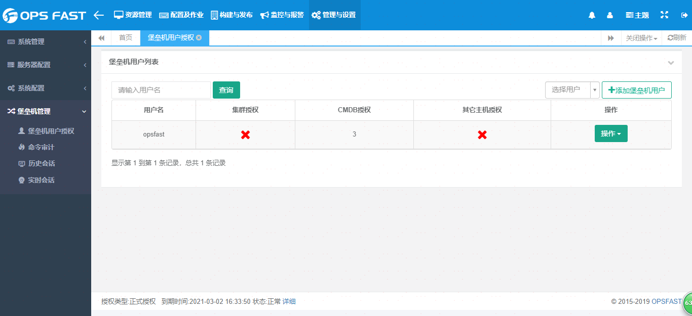

### Xshell访问
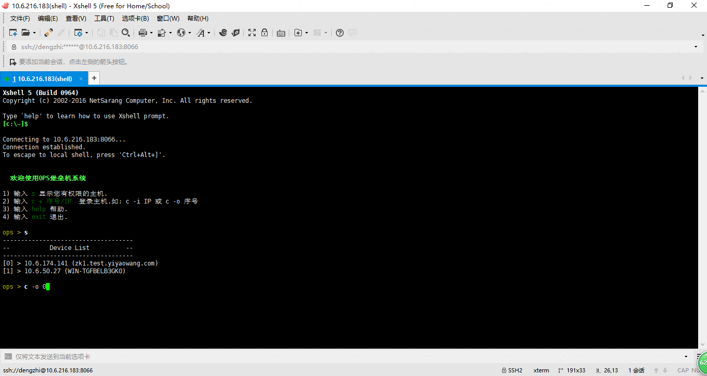
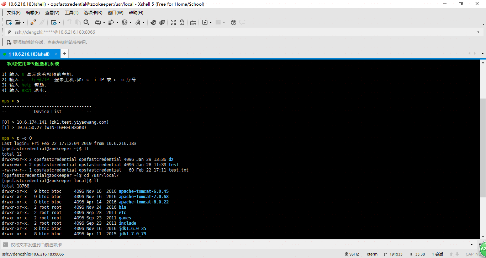
### Web访问
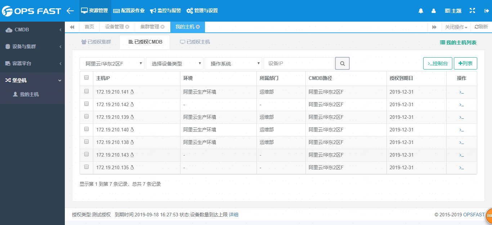
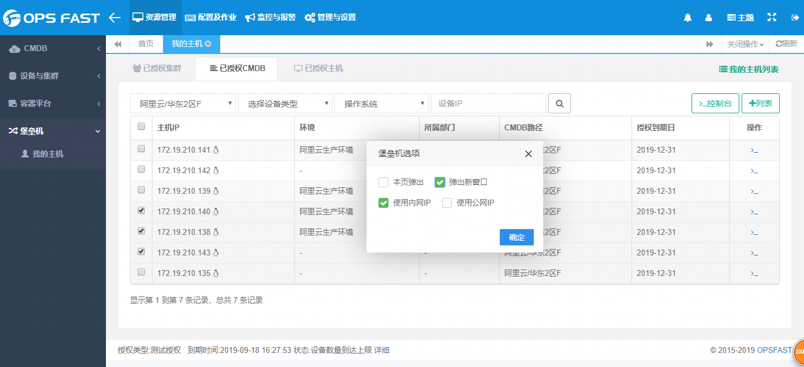
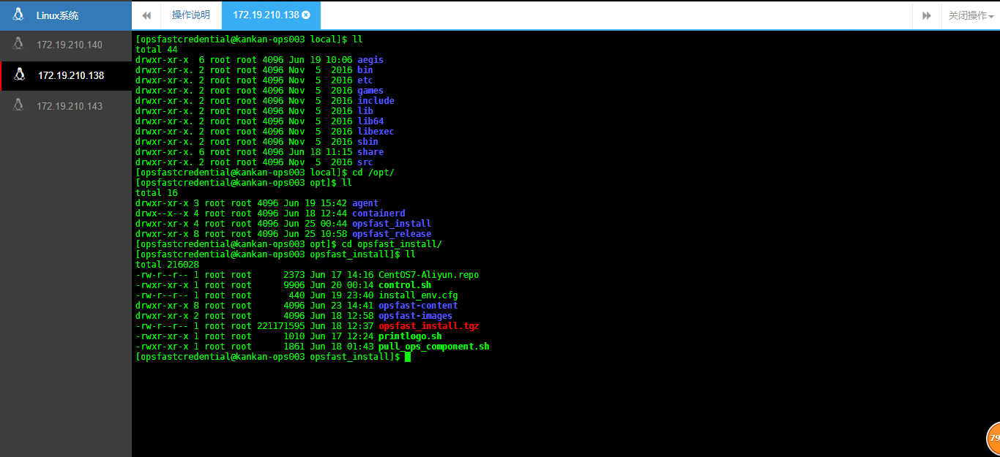
### 快捷键: Ctrl + Alt + Shift 呼出文件管理窗口
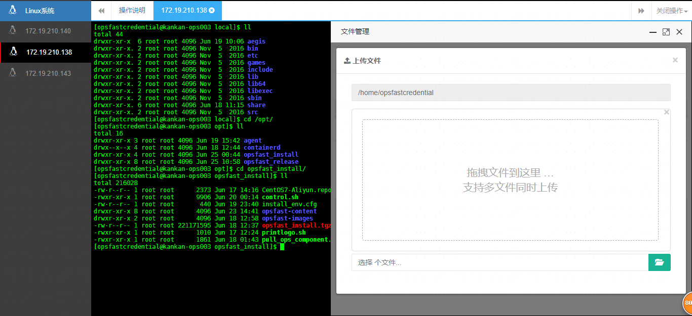
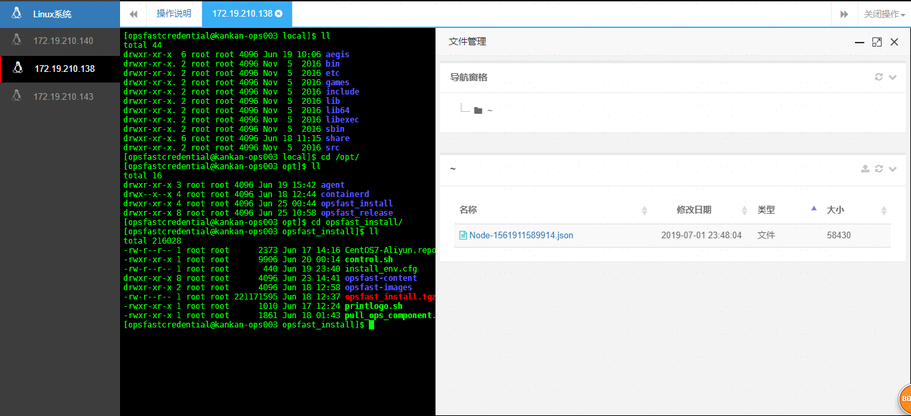
### 实时会话审计(直播)
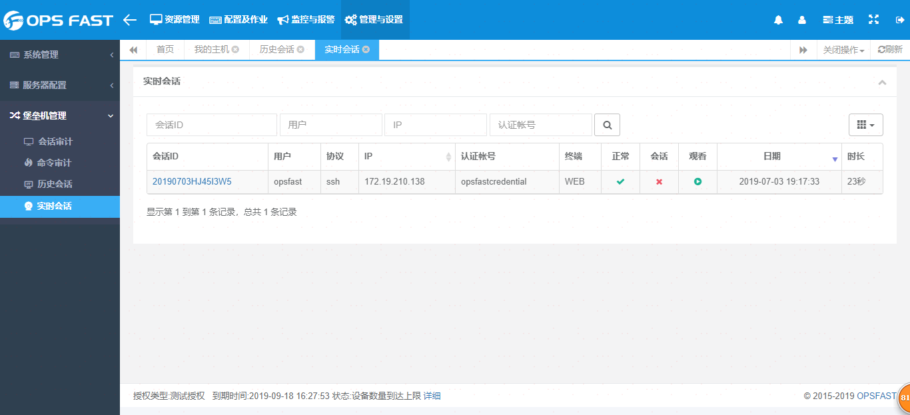
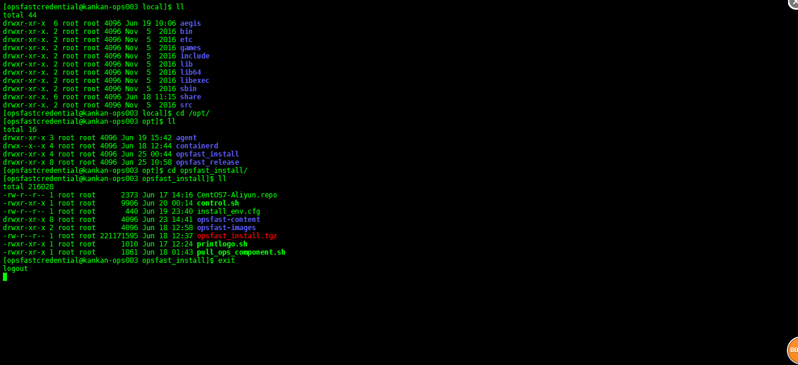
### 历史会话审计(重播)
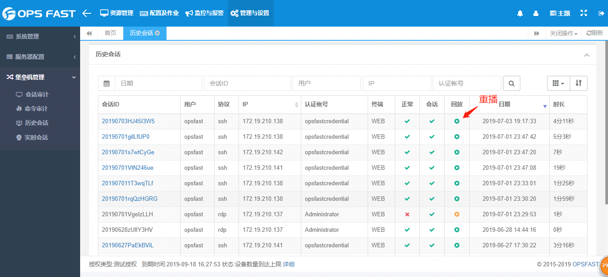
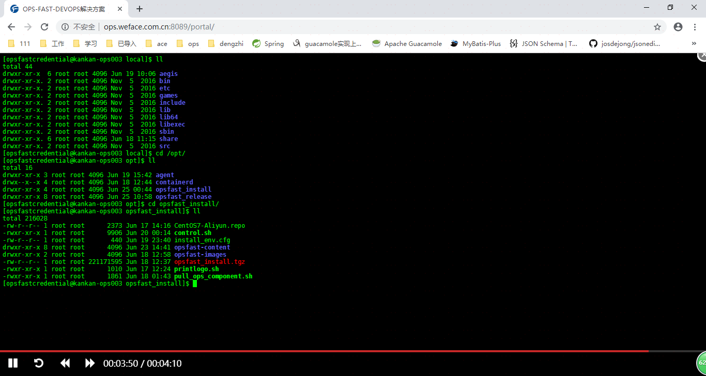
### 命令审计
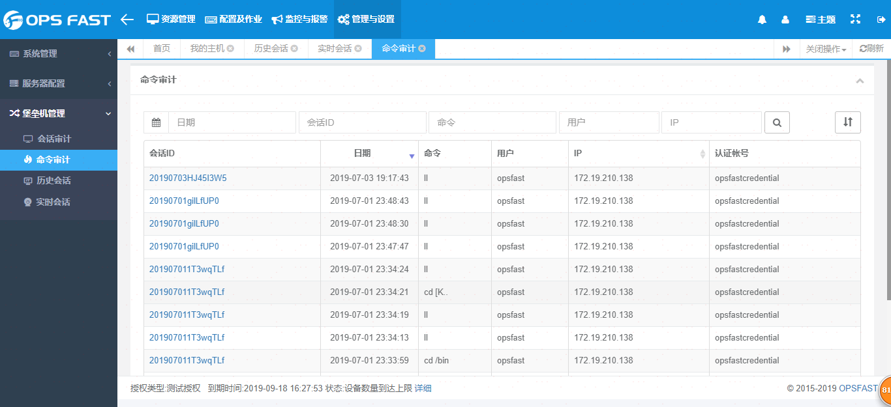
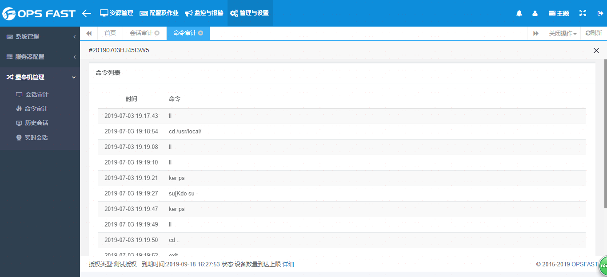

## Feedback

如果有好的意见或者建议，欢迎随时与[tony.deng][mail]沟通.

 [mail]: mailto:dz_005@163.com
 [demo]: http://www.opsfast.com
