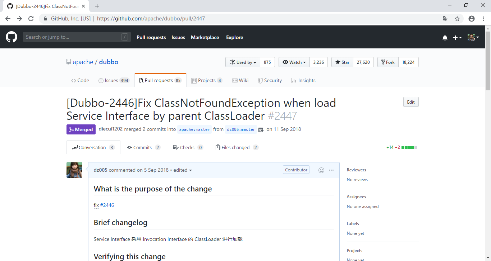
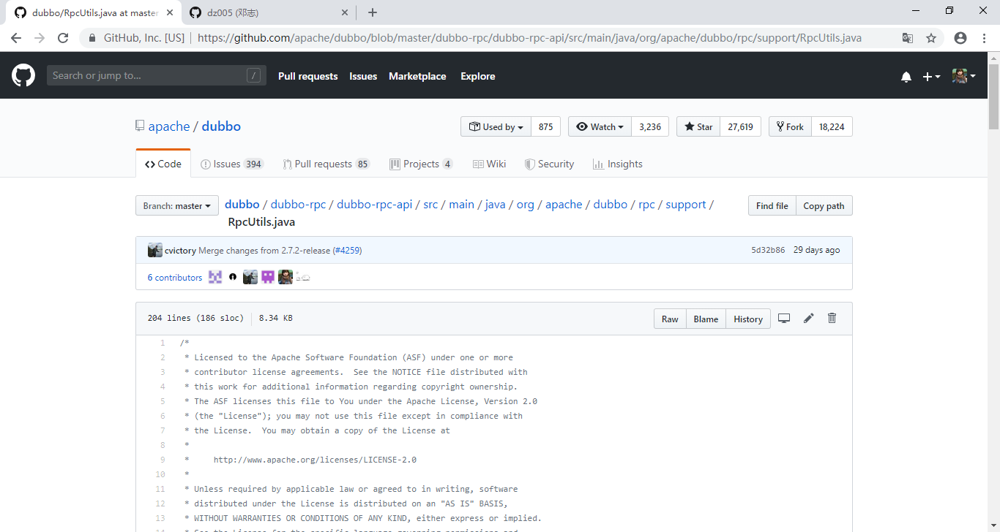
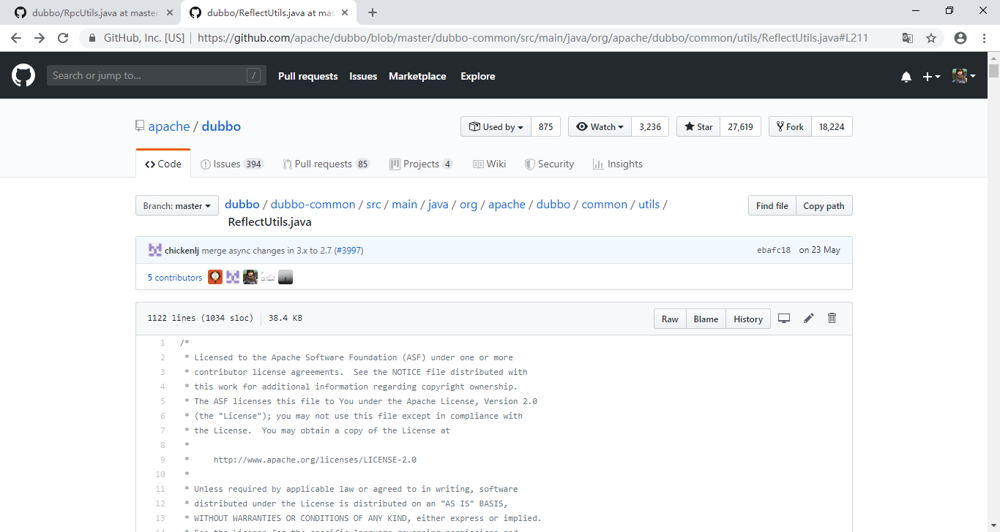
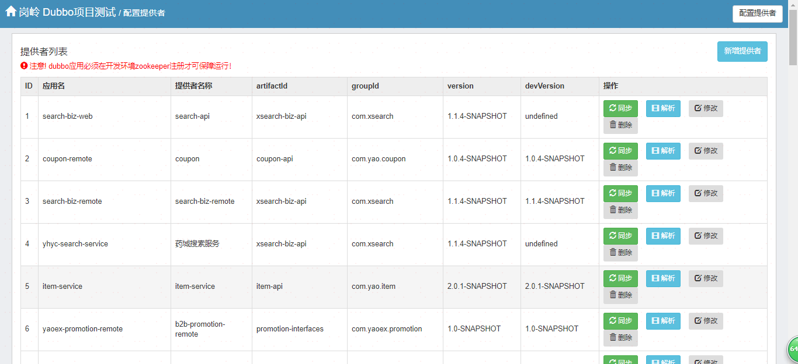
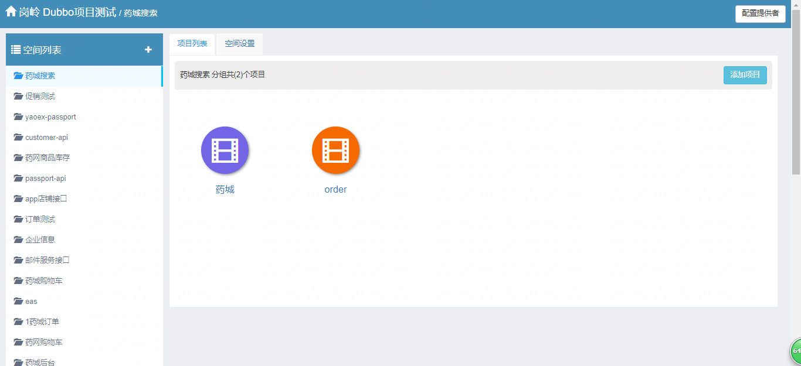
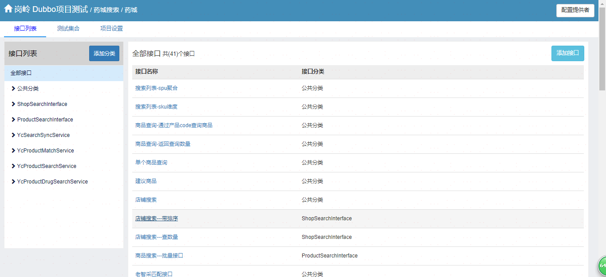
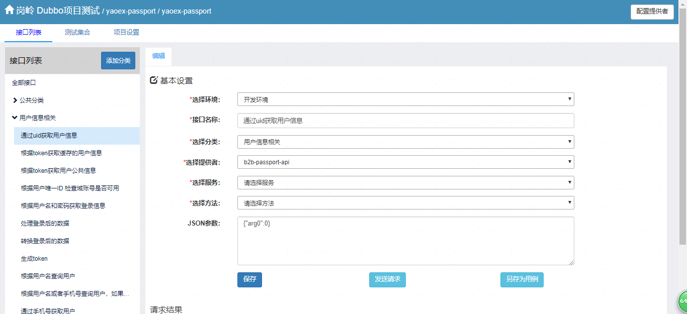
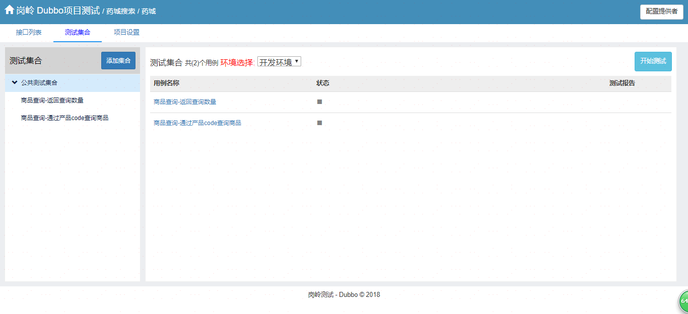

# Tony Dubbo

[在线demo][demo]

dubbo微服务间是相互依赖的，而各项目是独立分散的，这对自动化测试造成不小的困难，无法对各服务的测试结果有统一的认识，无法形成一个整体的自动化测试闭环。为了解决上述问题，开发了Tony Dubbo测试平台

## 遇到的问题

遇到问题: 用jarlink做dubbo隔离的时候,发现返回结果反序列化会偶尔出现ClassNotFoundException。
分析原因: dubbo的线程模型是异步的,请求消息和响应消息可能由不同的线程处理,通过ThreadLoacl无法获取到同一个ClassLoader
解决方法：从Invoker的Interface上获取ClassLoader
感谢@Jerrick Zhu的merge

## UI

### 配置dubbo服务jar的GAV

### 配置项目

### 关联接口

### 添加测试用例

### 批量测试

[在线demo][demo]

## Feedback

如果有好的意见或者建议，欢迎随时与[tony.deng][mail]沟通.

 [mail]: mailto:dz_005@163.com
 [demo]: http://dubbo.dengzhi.vip/view/dubbo/providerList
