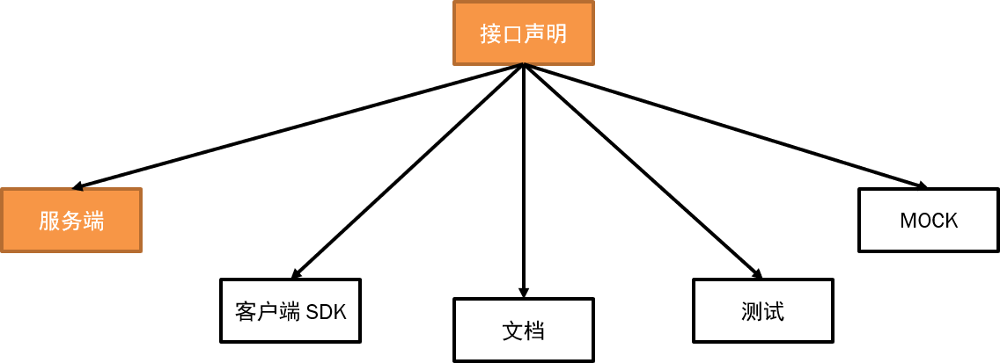

# tony-http-server-core

## 概念图



## HttpComponent处理

通过BeanPostProcessor扫描@HttpComponent,收集HttpBeanDefinition

```java
public class HttpAnnotationBeanPostProcessor implements BeanPostProcessor, InitializingBean {

	......

	@Override
	public Object postProcessBeforeInitialization(Object bean, String beanName) throws BeansException {
		HttpComponent httpComponent = AnnotationUtils.findAnnotation(bean.getClass(), HttpComponent.class);
		if (httpComponent != null) {
			httpBeanNames.add(beanName);
		}
		return bean;
	}

	@Override
	public Object postProcessAfterInitialization(Object bean, String beanName) throws BeansException {
		if (httpBeanNames.contains(beanName)) {
			Class<?> beanType = bean.getClass();
			HttpComponent httpComponent = AnnotationUtils.findAnnotation(beanType, HttpComponent.class);
			if (httpComponent != null) {
				HttpBeanDefinition httpBeanDefinition = new HttpBeanDefinition(beanName, httpComponent.title(),
						httpComponent.description());
	            ......
                httpBeanDefinitionHandler.handle(httpBeanDefinition);
			}
		}
		return bean;
	}
}
```

## 方法处理者

分别实现HandlerMethodResolver接口处理@Mapping, @Get, @Post 注解。
同时获取 @CrossOrigin，@Anonymous	，@Deprecated 的信息

```java
/**
 * 方法处理者
 * 
 * @author tony.deng
 */
public interface HandlerMethodResolver {

	boolean supportsMethod(HandlerMethod handlerMethod);

	Object resolveMethod(HandlerMethod handlerMethod, HandlerContext context)
			throws Exception;
}
```

## 参数处理者

分别实现HandlerMethodArgumentResolver接口处理@Param，@ParamMap，@Body 注解。
同时抓取参数对象的@Model，@Property，@EnumConstant的信息

```java
/**
 * 参数处理者
 * 
 * @author tony.deng
 */
public interface HandlerMethodArgumentResolver {

	/**
	 * 判断是否支持解决
	 * 
	 * @param parameter 方法参数对象
	 * @return true-支持，false-不支持
	 */
	boolean supportsParameter(MethodParameter parameter);

	/**
	 * 解决单个方法参数
	 * 
	 * @param parameter 方法参数对象
	 * @param context 执行上下文
	 * @return 解决处理后的参数值
	 * @throws Exception
	 */
	Object resolveArgument(MethodParameter parameter, HandlerContext context)
			throws Exception;
}
```
## 返回值处理者

实现HandlerMethodReturnValueHandler接口对返回值做转换
同时抓取参数对象的@Model，@Property，@EnumConstant的信息

```java
/**
 * 返回值处理者
 * 
 * @author tony.deng
 */
public interface HandlerMethodReturnValueHandler {

	boolean supportsReturnType(MethodParameter returnType);

	Object handleReturnValue(Object returnValue, MethodParameter returnType, HandlerContext context) throws Exception;

}
```

## Feedback

如果有好的意见或者建议，欢迎随时与[tony.deng][mail]沟通.

 [mail]: mailto:dz_005@163.com