# Tony Http UI

[在线demo][demo]

基于tony-http-annotation自定义注解自动生成文档，采用插件方式部署，通过jarslink实现类加载隔离，spring容器隔离，通过MDC和SiftingAppender实现日志隔离。
支持：
* 插件式热部署
* jar依赖分析
* 接口文档自动生成
* 接口测试
* 接口Mock
* 执行日志在线查看
* ......

## 概念图

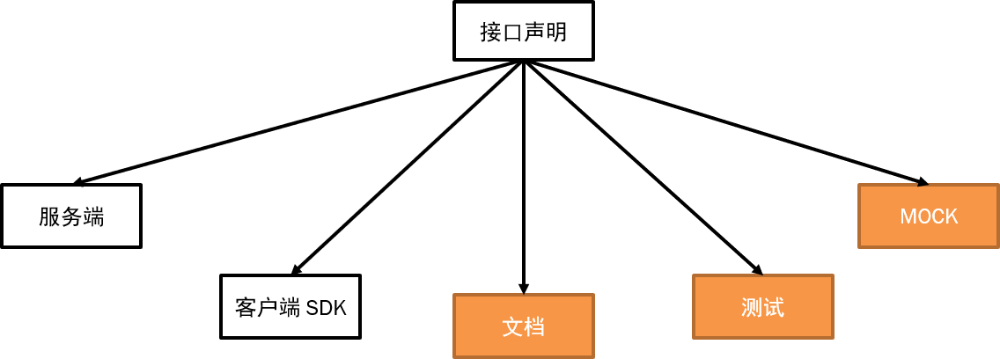

## UI

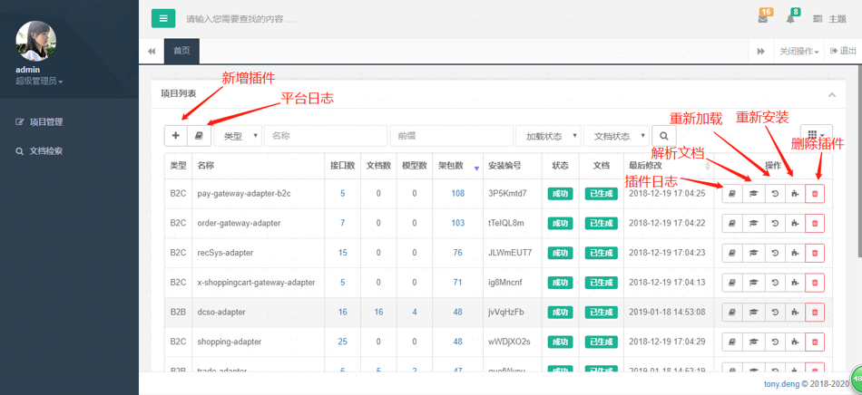
#### 新增插件
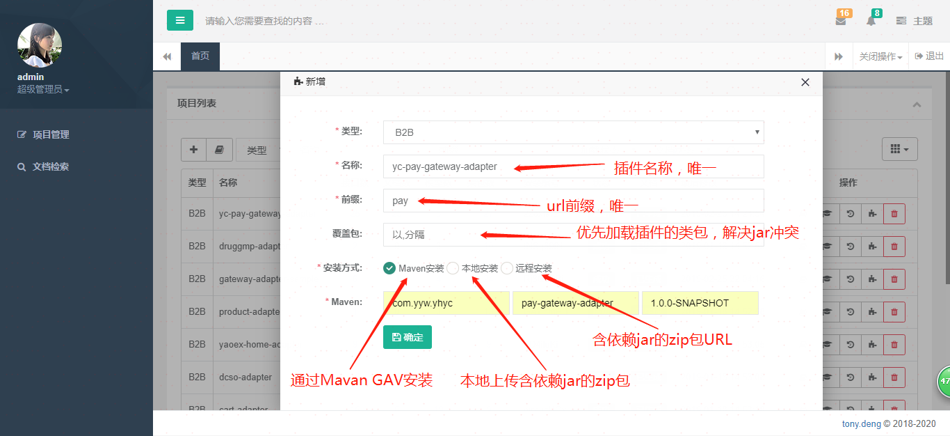
### 重新安装插件
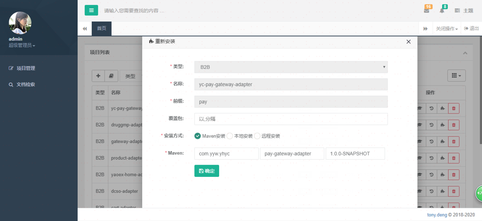
### 重新加载插件
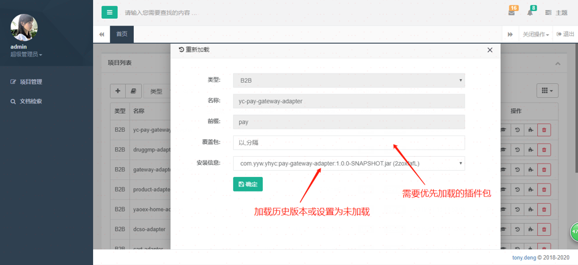
### jar依赖列表
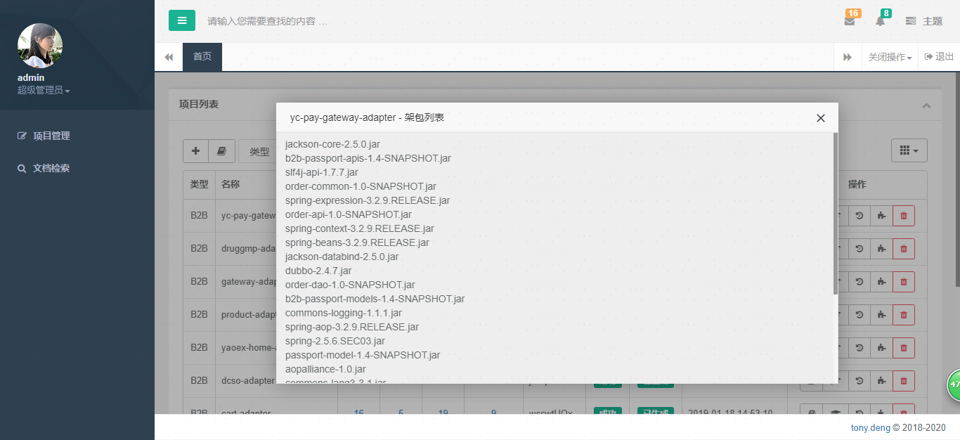
### 接口列表
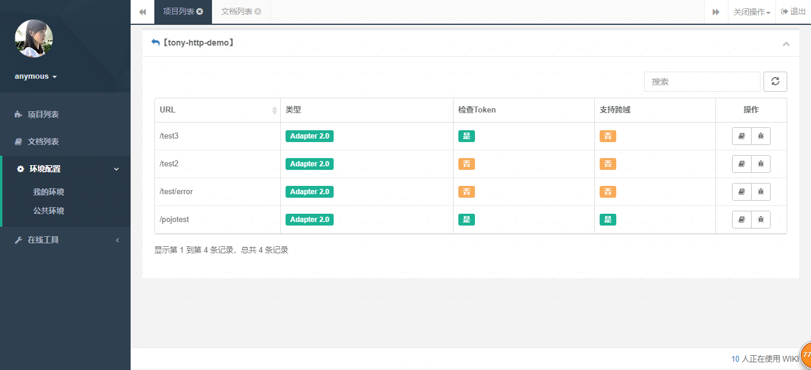
### 模型列表
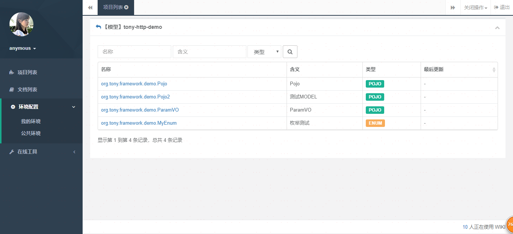
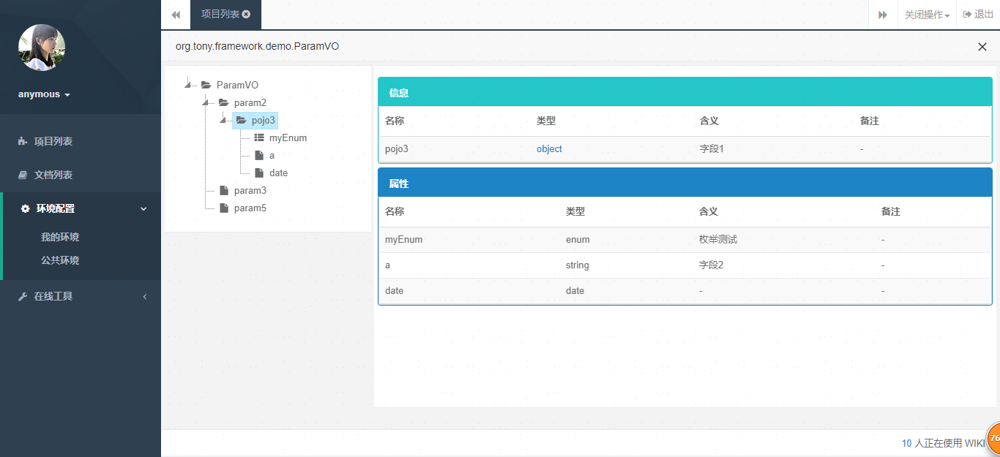
### 环境配置
可以配置平台环境(mock环境)，开发环境，测试环境，预发环境
可以配置 时间戳(变量)，签名(变量)，appId，token等公共请求参数
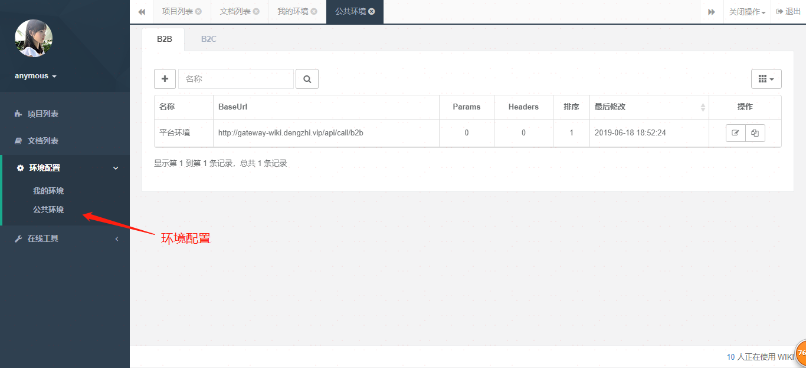
### 文档列表
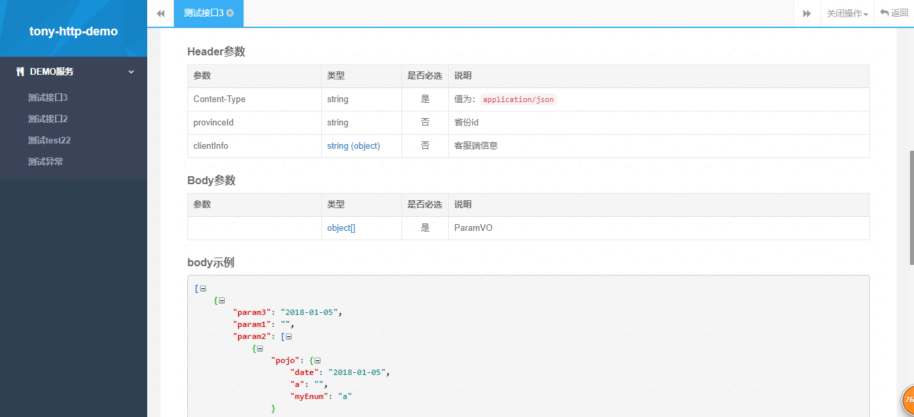
### 接口测试
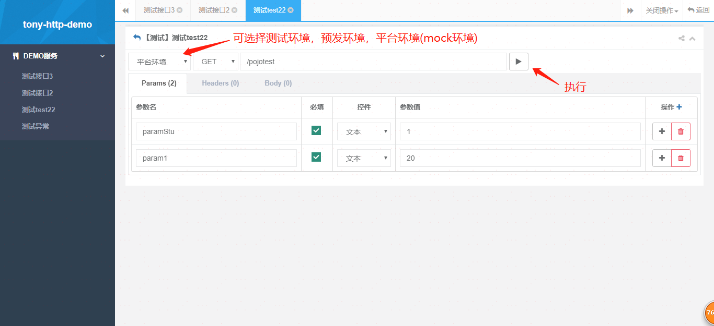
### 执行结果
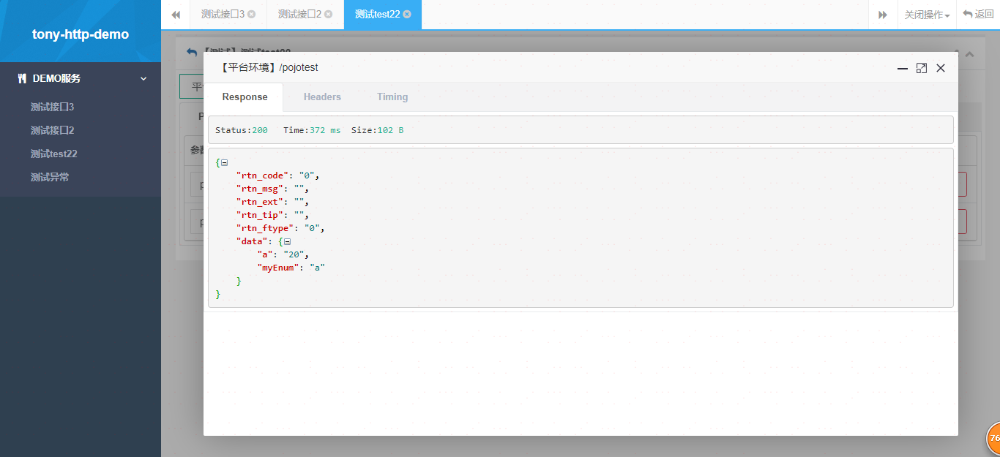
### Header信息
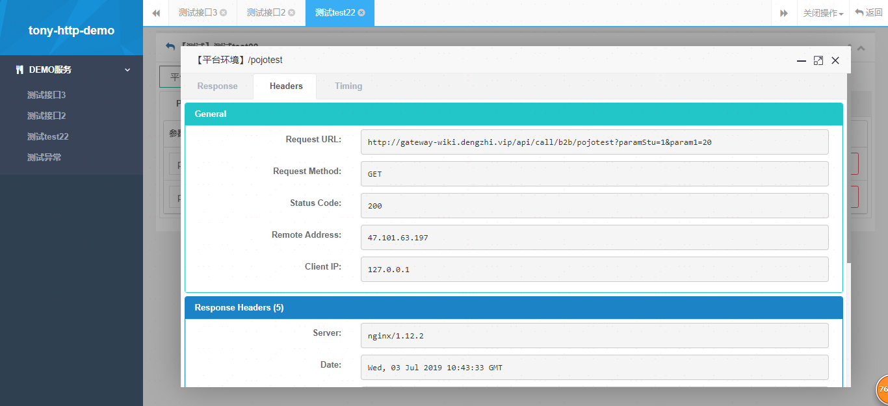
### 执行耗时分析
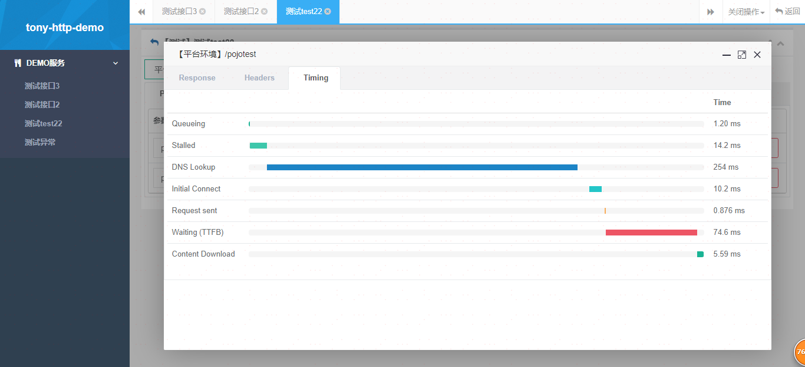

[在线demo][demo]

## Feedback

如果有好的意见或者建议，欢迎随时与[tony.deng][mail]沟通.

[mail]: mailto:dz_005@163.com
[demo]: http://gateway-wiki.dengzhi.vip